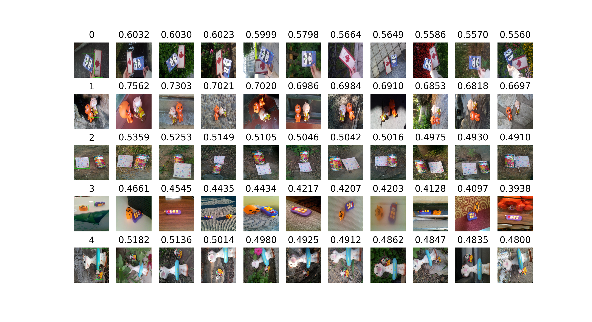

# Instance Search Project

A deep learning project for instance-level image search and retrieval using different backbone architectures.

## Project Overview

This project implements instance search algorithms using various deep learning models for image retrieval tasks.



## File Structure

```
instance_search/
├── .gitignore
├── README.md
├── extractor.py           # Feature extraction utilities
├── instance_search_base.py # Base class for instance search
├── instance_search_vgg.py  # VGG-based instance search implementation
├── instance_search_vit.py  # Vision Transformer-based instance search
├── run.py                 # Main execution script
└── script_run_experiments.sh # Experiment automation script
```

## Features

- **Multiple Backbone Support**: VGG and Vision Transformer (ViT) architectures
- **Feature Extraction**: Efficient feature extraction and similarity computation
- **Experimentation**: Automated experiment scripts for evaluation

## Models

- ResNet
- EfficientNet
- VGG
- Vision Transformer (ViT)

## Configuration

- Instance search method
- Output path
- Feature extraction batch size